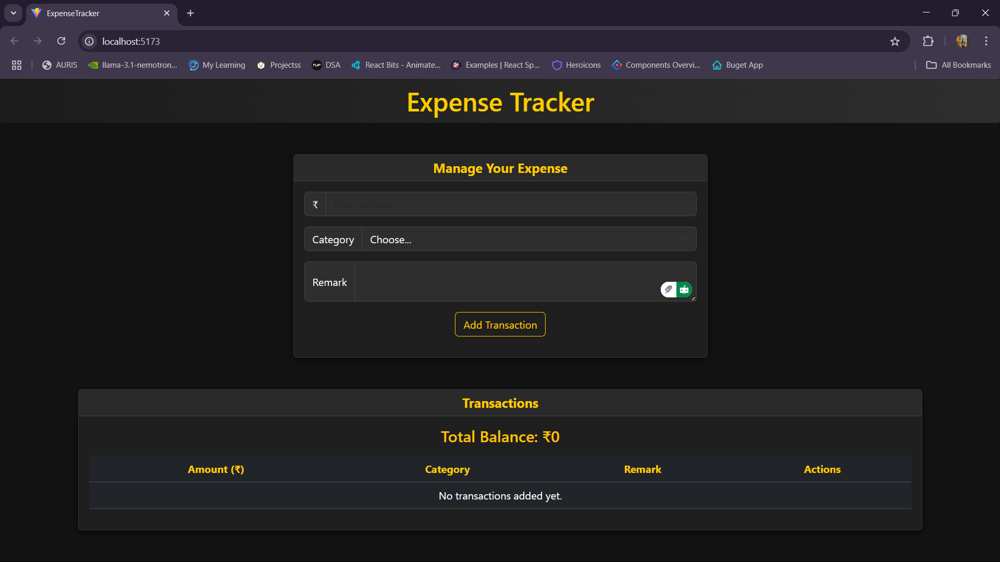
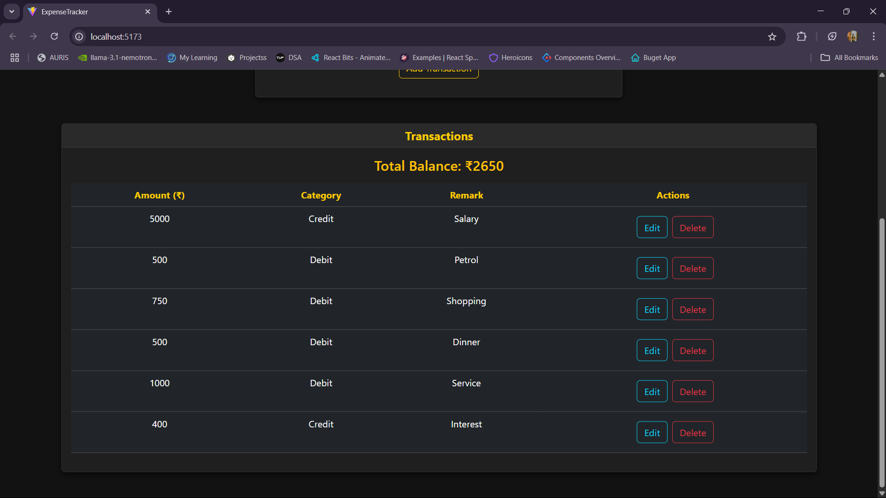

# 💸 Expense Tracker

A sleek and efficient Expense Tracker built using **React + Vite**, designed to help users manage their daily transactions with a modern dark-themed UI and real-time balance updates.


---

## 📸 Screenshots


| 💻 Dashboard View | 🧾 Transactions |
|------------------|-------------------|
|  |  |

---

## 🚀 Live Demo

🔗 [Click here to see the live app](https://your-vercel-link.vercel.app)


---

## 🛠️ Tech Stack

- ⚛️ React (with Vite)
- 🎨 Custom CSS (Dark Theme UI)
- 🧠 React Hooks (`useState`, `useEffect`)
- 📦 Bootstrap 5 Grid System
- 💾 Client-side State Management

---

## ✨ Features

- ➕ Add Transactions (Credit / Debit)
- 📝 Edit Existing Transactions
- ❌ Delete Transactions
- 💰 Real-Time Total Balance Tracker
- 🌙 Dark Themed Interface with Vibrant UI
- 📊 Responsive Design with Clean Layout
- 🔁 Smooth Hover Effects & Button Transitions

---

## 📂 Folder Structure

```
expense-tracker/
├── public/
│   └── vite.svg
├── src/
│   ├── App.jsx
│   ├── main.jsx
│   ├── ExpenseTracker.jsx
│   ├── ExpenseTracker.css
│   └── screenshots/
├── .gitignore
├── index.html
├── package.json
├── vite.config.js
└── README.md
```

---

## ⚙️ Getting Started

To run this project locally:

### 📦 Clone the repository
```bash
git clone https://github.com/your-username/expense-tracker.git
cd expense-tracker
```

### 📥 Install dependencies
```bash
npm install
```

### 🚀 Start the development server
```bash
npm run dev
```

---


---

## 🤝 Contributing

Contributions are welcome!

- ⭐ Star this repo
- 🐛 Report issues or bugs
- 🔧 Suggest improvements or submit pull requests

---

## 📜 License

This project is licensed under the [MIT License](LICENSE).

---

## 🙋‍♂️ Author

Built with ❤️ by **Het Patel**  
> 🇮🇳 Proud Indian | Web Developer | AI & Mythology Enthusiast  
> GitHub: [@Het1236](https://github.com/Het1236)

---
